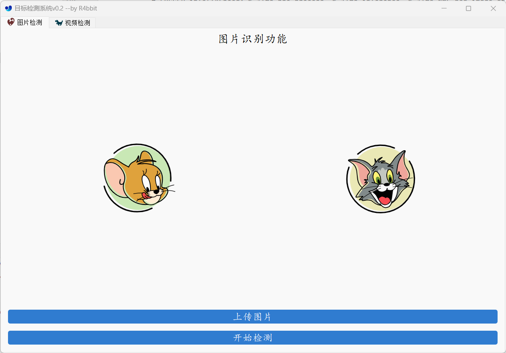

# YOLOv5-v7.0-UI
## Description
将YOLOv5-v7.0集成到PyQt中，比较简陋，可自行美化，比如使用pyside  

## environment config
```bash
# 创建
conda create -n yolo-ui python=3.8
# 激活
conda activate yolo-ui
# 切换目录到该项目根目录
pip install -r requirements.txt
# 也可以使用清华源下载：pip install -r requirements.txt -i https://pypi.tuna.tsinghua.edu.cn/simple
```
## Usage
### Step1: 下载预训练模型.pt
下载地址：https://github.com/ultralytics/yolov5/releases/tag/v7.0
自行选择.pt文件，下载完之后放在pt文件夹中
### Step2：修改模型路径
这里以下载yolov5x6.pt为例。
修改main.py中的`MainWindow`类的`init`方法的属性为`self.weights = "pt/yolov5x6.pt"`
### Step3：运行main.py
```bash
python main.py
```
### Step4：上传文件
datasets文件夹提供了图片和视频的demo，可以自行测试
## others
可自行修改是否使用gpu，是否需要dnn加速推理，修改yaml文件进行其他目标检测等等
